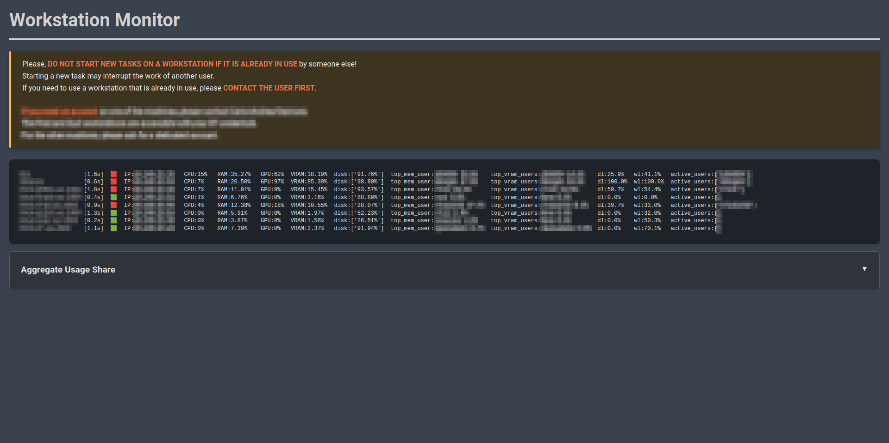

# WORKSTATION MONITOR

WSMONITOR is a very simple and lightweight tool for monitoring a group of independently managed computers.

You have a bunch of linux workstations in your lab and you want to keep track of which ones are free and who is using which?
You don't want to install complex tools and have something that is minimal and easy to install?
This may be the package for you.

This package will run:

* A worker on each workstation monitoring its CPU/GPU/RAM/VRAM/Disk resources
* On a single computer, a simple webserver displaying a recap of the status of each workstation.

On the main webpage you will get a recap like the following:



For each workstation then you can see the weekly usage history, also user by user.

## Web configuration

The web UI reads optional settings from `config/web_config.yaml` (override the location with the `WSMONITOR_WEB_CONFIG` environment variable). Use the `user_aliases` section to list usernames that should be treated as the same person when computing aggregated usage statistics. Example:

```
user_aliases:
	alice.rossi:
		- arossi_gpu
		- arossi_cpu
	shared_account:
		- ws-user-1
		- ws-user-2
```

After editing the file, restart the Flask server so the new aliases are loaded.

## Client configuration

Each workstation publishes its metrics using the settings stored in `config/publisher_config.yaml` (generated from `default_pub_config.yaml` by `install.sh`). The file is a plain YAML document passed to `ws_monitor.publisher` via `--config`, so anything you put there overrides the command-line flags. Typical content:

```
server: "tcp://monitoring-host:9452"
```

After modifying the config, restart the workstation publisher (systemd service or manual `launch_publisher_venv.sh`) so the new settings take effect.

## Installation

### On the server:

```
git clone https://github.com/c-rizz/ws_monitor
cd ws_monitor
python3 -m venv virtualenv
. virtualenv/bin/activate
pip install .
```

The webserver is not yet set up to be  started on boot, so you will need to start it manually:

```
cd ws_monitor
. virtualenv/bin/activate
wsmon_run_flask.sh
```


### On the workstations:

```
git clone https://github.com/c-rizz/ws_monitor
cd ws_monitor
./install.sh # this requires sudo rights, but you may be able to also run things manually without it, just check the contents
```

