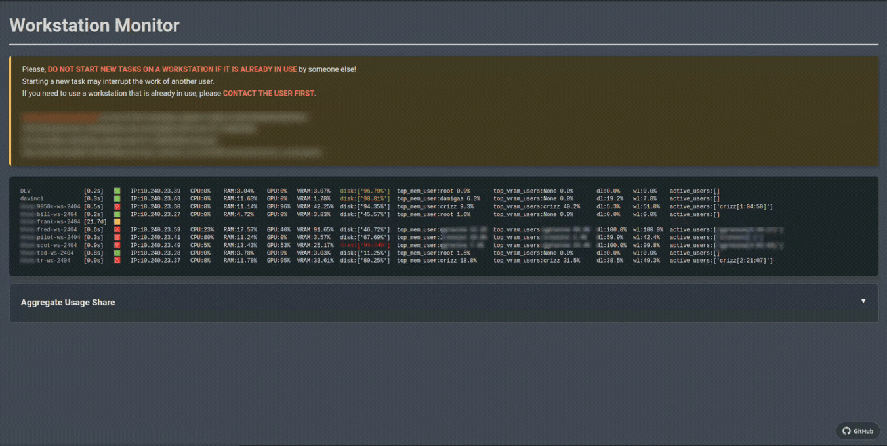

# WORKSTATION MONITOR

*See at a glance which of your lab's workstations are free, who's using what, and how busy each GPU/CPU is, no root required, easy to set up.*



You have a bunch of linux workstations in your lab and you want to keep track of which ones are free and who is using which?
You don't want to install complex tools and have something that is minimal and easy to install?
This may be the package for you.

* Per-workstation CPU / GPU / RAM / VRAM / disk monitoring
* Central web dashboard, live status
* Weekly usage history, per-machine and per-user
* No root required (systemd --user services)
* Single pipx install, minimal dependencies

## Installation

### On the server:

```
pipx install "git+https://github.com/c-rizz/ws_monitor.git"
```

To just try it out, run it directly:

```
wsmon-server --port 9452
```

To have it start automatically on boot, install it as a systemd `--user` service (no sudo required):

```
wsmon-server --port 9452 --install-service
```

This writes a unit to `~/.config/systemd/user/` and enables lingering for your account so it also comes up after a reboot, before you log in. `wsmon-server` runs behind gunicorn by default; pass `--dev-server` to use Flask's built-in dev server instead (not recommended outside development). See `wsmon-server --help` for other options (`--port`, `--workers`).


### On the workstations:

```
pipx install "git+https://github.com/c-rizz/ws_monitor.git"
wsmon-publisher --server tcp://<server-address>:9452 --install-service
```

The second command registers `wsmon-publisher` as a systemd `--user` service the same way as above (no sudo needed).


## Configuration

### Web Server

The web UI reads optional settings from `~/.config/ws_monitor/web_config.yaml` (respects `$XDG_CONFIG_HOME` if set, and the location can be overridden entirely with the `WSMONITOR_WEB_CONFIG` environment variable). You can configure:
 * The `user_aliases` section to list usernames that should be treated as the same person when computing aggregated usage statistics. 
 * The `notice_html` section to change the notice on the web server main page

Example:

```
user_aliases:
	alice.rossi:
		- arossi_workstation1
		- arossi_workstation2
	jhon.doe:
		- jdoe
		- jhondoe

notice_html: |
   Please, <strong>DO NOT START NEW TASKS ON A WORKSTATION IF IT IS ALREADY IN USE</strong> by someone else!<br>
   If you need to use a workstation that is already in use, please <strong>CONTACT THE USER FIRST</strong>.<br>
```

After editing the file, restart the Flask server so the changes are loaded.

### Clients

Each workstation's publisher can be configured either with plain CLI flags (e.g. `wsmon-publisher --server tcp://monitoring-host:9452`, as used above) or with a YAML file passed via `--config <path>`; if you use both, any CLI flag you pass takes precedence over the matching value in the file. Typical content:

```
server: "tcp://monitoring-host:9452"
```

After modifying the config, restart the workstation publisher so the new settings take effect: `systemctl --user restart wsmonitor-publisher` if you installed it as a service (see Installation above), or just re-run `wsmon-publisher --config <path>` otherwise.


## License

WSMONITOR is licensed under the [Apache License 2.0](LICENSE).
