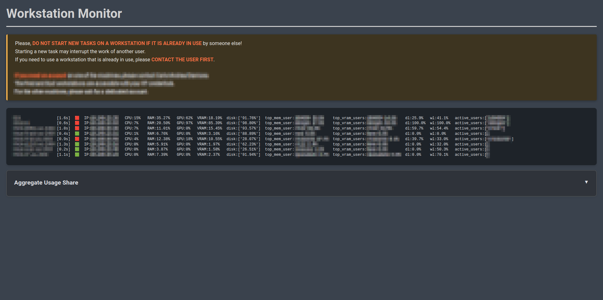

# WORKSTATION MONITOR

WSMONITOR is a very simple and lightweight tool for monitoring a group of independently managed computers.

You have a bunch of linux workstations in your lab and you want to keep track of which ones are free and who is using which?
You don't want to install complex tools and have something that is minimal and easy to install?
This may be the package for you.

This package will run:

* A worker on each workstation monitoring its CPU/GPU/RAM/VRAM/Disk resources
* On a single computer, a simple webserver displaying a recap of the status of each workstation.

On the main webpage you will get a recap like the following:



For each workstation then you can see the weekly usage history, also user by user.

## Web configuration

The web UI reads optional settings from `~/.config/ws_monitor/web_config.yaml` (respects `$XDG_CONFIG_HOME` if set, and the location can be overridden entirely with the `WSMONITOR_WEB_CONFIG` environment variable). Use the `user_aliases` section to list usernames that should be treated as the same person when computing aggregated usage statistics. Example:

```
user_aliases:
	alice.rossi:
		- arossi_gpu
		- arossi_cpu
	shared_account:
		- ws-user-1
		- ws-user-2
```

After editing the file, restart the Flask server so the new aliases are loaded.

## Client configuration

Each workstation publishes its metrics using the settings stored in `~/.config/ws_monitor/publisher_config.yaml` (generated from `default_pub_config.yaml` by `install_client.sh`). The file is a plain YAML document passed to `ws_monitor.publisher` via `--config`, so anything you put there overrides the command-line flags. Typical content:

```
server: "tcp://monitoring-host:9452"
```

After modifying the config, restart the workstation publisher so the new settings take effect: `systemctl --user restart wsmonitor-publisher` if you installed it as a service (see below), or just re-run `wsmon-publisher --config <path>` otherwise.

## Installation

### On the server:

```
pipx install "git+https://github.com/c-rizz/ws_monitor.git"
```

To just try it out, run it directly:

```
wsmon-server
```

To have it start automatically on boot, install it as a systemd `--user` service (no sudo required):

```
wsmon-server --install-service
```

This writes a unit to `~/.config/systemd/user/` and enables lingering for your account so it also comes up after a reboot, before you log in. `wsmon-server` runs behind gunicorn by default; pass `--dev-server` to use Flask's built-in dev server instead (not recommended outside development). See `wsmon-server --help` for other options (`--port`, `--workers`).


### On the workstations:

```
pipx install "git+https://github.com/c-rizz/ws_monitor.git"
wsmon-publisher --server tcp://monitoring-host:9452 --install-service
```

The second command registers `wsmon-publisher` as a systemd `--user` service the same way as above (no sudo needed). If you'd rather clone the repo and get an interactive prompt for the server address instead of passing `--server` by hand:

```
git clone https://github.com/c-rizz/ws_monitor
cd ws_monitor
./install_client.sh
```

## License

WSMONITOR is licensed under the [GNU Affero General Public License v3.0](LICENSE). If you run a modified version of this software as a network service, the AGPL requires that you make the modified source available to the users of that service.

